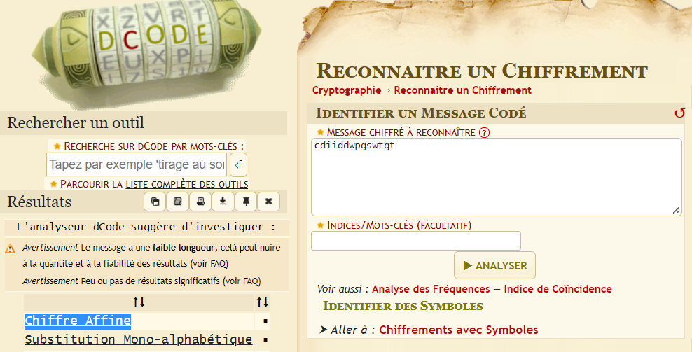
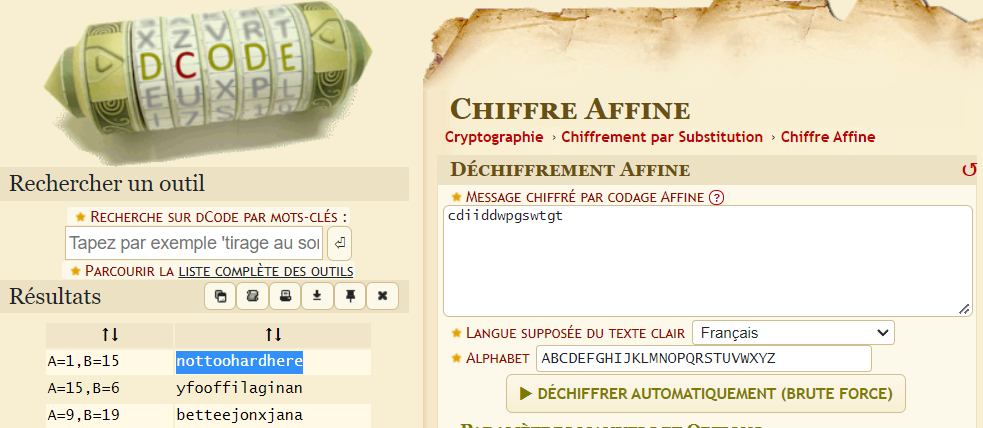

# LEVEL 01

At this point, we're lost, so we have to find something to exploit.
we know that our aim is to launch `getflag` with `flag[current_lvl]` perms.


```
here is an example from the subject

level00@SnowCrash:~$ su flag00
Password:
Don't forget to launch getflag !
flag00@SnowCrash:~$ getflag
Check flag.Here is your token : ?????????????????
flag00@SnowCrash:~$ su level01
Password:
level01@SnowCrash:~$ _
```

We can get more informations about users and groups.
```
cat /etc/passwd
flag00:x:3000:3000::/home/flag/flag00:/bin/bash
```

So if we find files with current flag permissions.
```
level00@SnowCrash:~$ find / -uid 3000 2>/dev/null
/usr/sbin/john
/rofs/usr/sbin/john
```

```
level00@SnowCrash:~$ cat /usr/sbin/john
cdiiddwpgswtgt
```
But it doesn't works.
```
level00@SnowCrash:~$ su flag00
Password:
su: Authentication failure
```

Maybe its encrypted, there is a tool online that can detect which type of encryption its used for a given password
`https://www.dcode.fr/identification-chiffrement`


Trying to use the first encryption result, we get a readable string.


#### IT WORKS !!
```
level00@SnowCrash:~$ su flag00
Password:
Don't forget to launch getflag !
flag00@SnowCrash:~$ getflag
Check flag.Here is your token : xxxxxxxxxxxxxxxxxxxxxxx
```