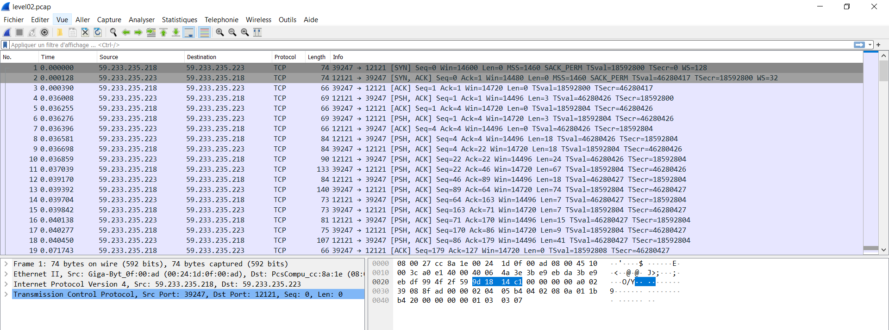
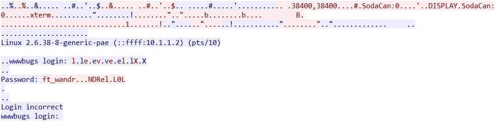
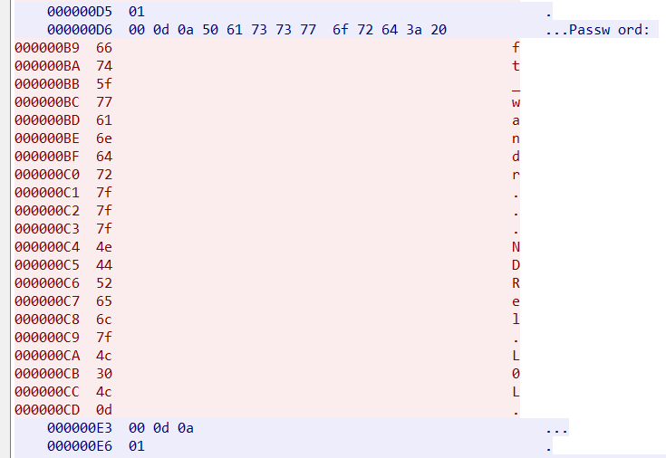

# LEVEL 03

For his level, 42 is kind, we have a clue in the home directory.

```
level02@SnowCrash:~$ ls
level02.pcap
```

The .pcap file extension is mainly associated with Wireshark; a program used for analyzing networks

So we can open it with Wireshark.


`CTRL + ALT + MAJ + T` open a windows with the full TCP flow


Theses packets describ a linux authentication, and there Password prompt if in clear text
The trick is the '.' char is not a alphanum char, but if we dump theses characters as hexa code we obtains


the hexa ascii code for the '.' in wireshark stand for `7f` which is `DEL` char

The final result is `ft_waNDReL0L`

#### IT WORKS !!

```
level02@SnowCrash:~$ su flag02
Password:
Don't forget to launch getflag !
flag02@SnowCrash:~$ getflag
Check flag.Here is your token : xxxxxxxxxxxxxxxxxx
```

